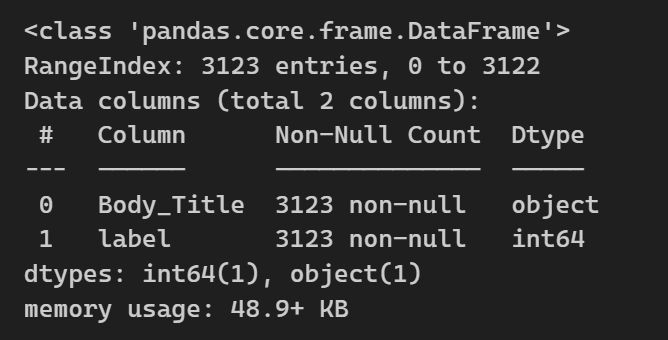
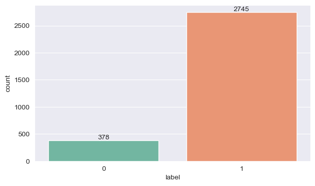
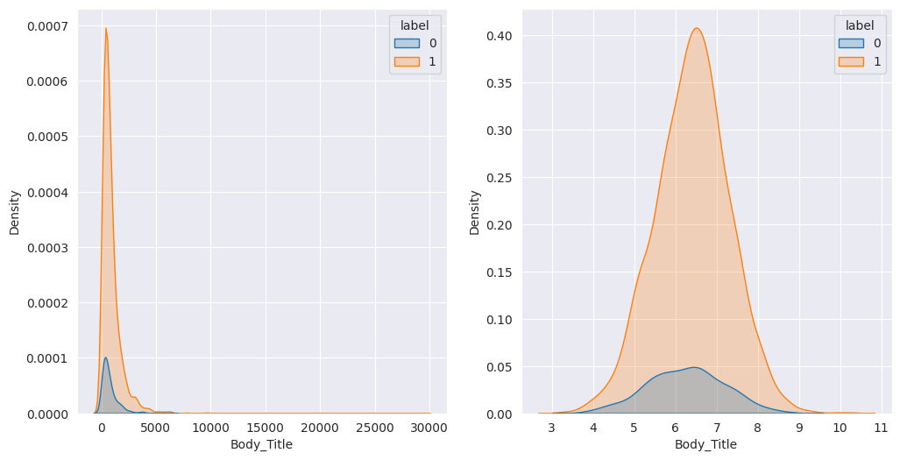
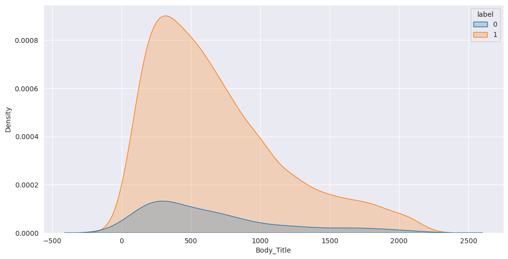

# Laporan Proyek Machine Learning - Jordan Marcelino

## Domain Proyek

_Mental health_ adalah istilah yang sudah tidak asing lagi untuk didengar di era modern ini. Istilah ini sering digunakan oleh kaum muda untuk membahas kondisi psikologis & emosional seseorang. Banyak hal yang dapat memengaruhi kondisi _mental health_ seseorang, media sosial adalah salah satunya [1](#1). Maraknya penggunaan media sosial saat ini menyebabkan banyaknya orang menaruh jati dirinya pada hal tersebut, sehingga kondisi _mental health_ seseorang akan sangat bergantung pada media sosial. Pesan atau komen yang diberikan oleh seseorang pada media sosial dapat secara tidak langsung mencerminkan kondisi _mental health_ orang tersebut [1](#1). Untuk dapat mengetahui kondisi _mental health_ seseorang melalui pesan atau komen yang disampaikan memerlukan pengetahuan yang lebih dibidang psikologis dan bahasa atau memerlukan _expert_ dibidangnya. Maka dari itu, untuk dapat mengetahui kondisi _mental health_ khususnya untuk mendeteksi stres secara otomatis melalui teks yang disampaikan, tanpa memiliki pengetahuan yang mendalam dibidangnya, proyek ini dilakukan. Proyek ini bertujuan untuk mendeteksi stres dari artikel media sosial berbasis teks dari Reddit menggunakan pendekatan _machine learning_.

Dengan adanya model _machine learning_ dapat membantu menyelesaikan permasalahan yang diangkat dengan mengidentifikasi pola-pola dalam teks yang berkaitan dengan kondisi stres. Ini bisa termasuk pola kata-kata atau frasa tertentu yang sering muncul dalam konteks yang berkaitan dengan stres, ekspresi emosional yang khas, atau bahkan struktur kalimat yang mengindikasikan kecemasan atau tekanan. Model klasifikasi dapat memproses teks yang baru dan secara otomatis mengklasifikasikannya sebagai positif (tidak stres) atau negatif (stres). Ini akan membantu dalam mengidentifikasi konten-konten yang mungkin mengindikasikan adanya stres di antara berbagai artikel media sosial.

## Business Understanding

Untuk dapat mengetahui kondisi _mental health_ seseorang melalui suatu teks, diperlukan peran _expert_ dibidangnya, dan untuk dapat berkonsultasi dengan _expert_ diperlukan biaya yang tidak murah. Hal ini bisa diotomasi menggunakan metode pemrosesan bahasa alami melalui _machine learning_. Dengan adanya otomasi ini, maka tanpa mengeluarkan biaya untuk berkonsultasi dengan _expert_, kita dapat mengetahui kondisi _mental health_ seseorang. Proyek ini disempitkan pada kasus deteksi stres.

### Problem Statements

-   Bagaimana efektivitas pendekatan _machine learning_ dalam mengklasifikan stres berdasarkan teks artikel media sosial jika dilihat dari nilai metriks: akurasi, presisi, recall, dan f1-score?

### Goals

-   Mengevaluasi efektivitas pendekatan _machine learning_ dalam mengklasifikan stres berdasarkan teks artikel media sosial dengan melihat nilai metriks: akurasi, presisi, recall, dan f1-score

    ### Solution statements

    -   Melakukan improvement pada _Random Forest_ sebagai _baseline model_ dengan _hyperparameter tuning_ menggunakan _grid search_ dan melakukan cross validation dengan split sebanyak 3.

## Data Understanding

Data yang digunakan dalam proyek ini diambil dari [Kaggle Datasets](https://www.kaggle.com/datasets/mexwell/stress-detection-from-social-media-articles/data) yang berjudul "**Stress Detection from Social Media Articles**". Terdapat 4 dataset yang disediakan yaitu:

1.  Reddit_Combi.csv
2.  Reddit_Title.csv
3.  Twitter_Non-Advert-Tabelle 1.csv
4.  Twitter_Full.csv

Namun, proyek ini hanya akan menggunakan dataset pertama (Reddit_Combi.csv)

### Variabel-variabel pada Reddit_Combi dataset adalah sebagai berikut:

-   title : merupakan judul artikel.
-   body : merupakan isi artikel.
-   Body_Title : merupakan judul artikel dan isi artikel yang digabung menjadi satu kumpulan teks.
-   label : merupakan indikator stres, dimana 1 mengindikasikan stres, 0 tidak stres

### EDA (Exploratory Data Analysis)

-   Deskriptif data
    
    Gambar 1. Deskriptif Data

    Data yang digunakan berjumlah 3123 baris dan terdiri dari 2 kolom, yaitu: Body_Title dan label. Body_Title adalah gabungan dari judul artikel dan isi artikel, sedangkan label adalah indikator stres, dimana 0 mengindikasikan positif (tidak stres), 1 mengindikasikan negative (stres).

-   Menvisualisasikan distribusi label
    
    Gambar 2. Distribusi Label

    Dapat dilihat pada Gambar 2 bahwa dataset ini termasuk imbalanced dataset, dimana terdapat ketidakseimbangan antar label. Label 0 berjumlah 378, sedangkan label 1 berjumlah 2745.

-   Menvisualisasikan sebaran panjang teks artikel berdasarkan label

    
    Gambar 3. Sebaran Panjang Teks

    Gambar 3 menunjukkan sebaran panjang teks dalam dataset terpusat pada 1000-3000 karakter. Namun, gambar membentang sampai puluhan ribu, yang berarti terdapat teks outlier yang panjang karakternya mencapai puluhan ribu karakter.

-   Membuang outlier berdasarkan panjang teks dengan metode IQR
    
    Gambar 4. Membuang Outlier

    Teks dengan jumlah karakter tertentu akan dibuang dari dataset. Setelah outlier dibuang, sebaran panjang teks menjadi lebih jelas yaitu 500-2000 karakter.

## Data Preparation

### Data preprocessing

1.  Penanganan imbalanced label
    Karena terdapat ketidakseimbangan label pada data, maka akan digunakan teknik _over sampling_ dengan menduplikasi data yang tidak seimbang sampai jumlahnya sama besar. Kegunaannya adalah agar model dapat mempelajari dengan baik perbedaan antar label. Hasil ini dilakukan dengan cara:

    1.  Mengambil jumlah sampel yang lebih banyak
    2.  Menduplikat sampel yang lebih sedikit sampai jumlahnya sama dengan sampel yang lebih banyak
    3.  Menggabungkan hasilnya menjadi satu

    Selanjutnya, setelah melalui proses trial & error, data akan diambil sejumlah 2000 sampel saja yang terdiri dari 1000 sampel yang berlabel 0 dan 1000 sampel yang berlabel 1. Hal ini dilakukan karena jumlah sampel yang lebih dari itu akan memakan waktu yang sangat lama ketika melakukan preprocessing.

2.  Splitting data
    Data akan displit menjadi train dan test dengan test size sebesar 10%. Train data akan digunakan untuk melatih model, sedangkan test data akan digunakan untuk mengukur performa model pada data yang belum pernah dilihat sebelumnya.

3.  Text preprocessing
    Untuk memastikan bahwa teks dapat memberikan informasi yang berharga maka dilakukan tahapan preprocessing, sebagai berikut:

    1.  Mengubah semua teks menjadi huruf kecil (menjaga konsistensi teks).
    2.  Membuang noise seperti; special character, angka, tautan, dll (membuang informasi yang tidak berharga untuk model).
    3.  Memperbaiki kesalahan ejaan (menjaga konsistensi penulisan kata).
    4.  Tokenisasi teks (memecah teks menjadi token atau kata secara individu).
    5.  Membuang stop words (membuang kata-kata yang sering muncul dan tidak terlalu bermakna).
    6.  Membatasi jumlah kata sebanyak 512 kata (menghindari teks yang terlalu panjang)
    7.  Melakukan stemming (mengembalikan kata menjadi kata dasar dengan membuang imbuhan).
    8.  Vektorisasi teks menggunakan TF-IDF (mengubah teks menjadi angka agar dapat dimengerti model).

### Modeling

-   Tahapan pertama adalah data preprocessing, di mana data dari dataset dipersiapkan untuk digunakan dalam pembuatan model. Untuk lebih detail sudah dijelaskan pada bagian [data preparation](#data-preparation)

-   Selanjutnya, data dibagi menjadi dua subset utama: data pelatihan dan data uji. Data pelatihan digunakan untuk melatih model, sementara data uji digunakan untuk menguji kinerja model yang telah dilatih. Pembagian ini biasanya dilakukan secara acak dan distribusi label yang seimbang dengan proporsi 90% data latih dan 10% data uji.

-   _RandomForestClassifer_ adalah salah satu algoritma _machine learning_ yang populer dan banyak digunakan. Proyek ini akan menggunakan algoritma _RandomForestClassifer_ _sebagai baseline model_. Algoritma tersebut dipilih karena kemampuannya yang dapat menangani fitur berdimensi tinggi, tidak sensitive terhadap _outlier_ atau pun _noise_, dan _random forest_ secara implisit telah menerapkan proses seleksi fitur. Dibandingkan dengan algoritma lain, KNN misalnya, yang bergantung pada kemiripan antar fitur, fitur berdimensi tinggi akan menjadi penghalang model untuk mempelajari data. Maka dari itu _Random Forest_ akan digunakan sebagai baseline model.

-   Proses hyperparameter tuning dilakukan untuk mencari kombinasi hyperparameter yang memberikan kinerja terbaik untuk model. Selanjutnya akan diterapkan teknik cross-validation dengan jumlah split sebanyak 3 untuk memeriksa kinerja model dengan berbagai kombinasi hyperparameter. Metriuk utama yang digunakan dalam tuning dan cross-validation adalah akurasi, model dengan akurasi tertinggi akan dianggap sebagai model terbaik. Hyperparameter yang dituning sebagai berikut:

-   n_estimators: [50, 100, 200]
-   max_depth: [16, 32]
-   max_features: [sqrt, log2]
-   min_samples_split: [2, 5]

Hasil _hyperparameter tuning_ pada _RandomForestClassifier_ menghasilkan model terbaik dengan hyperparameter sebagai berikut:

-   n_estimators: 100
-   max_depth: 32
-   max_features: sqrt
-   min_samples_split: 2

### Evaluation

Model akan dievaluasi pada test set untuk memastikan bahwa model tidak overfit, dan dapat memprediksi data yang belum pernah dilihat secara akurat. Terdapat 4 metrik evaluasi yang digunakan:

-   $ Accuracy = \frac{(TP+TN)}{(TP+TN+FN+FP)} $

-   $ Precision = \frac{TP}{(TP+FP)} $

-   $ Recall = \frac{TP}{(TP+FN)} $

-   $ F1 = \frac{(2*precision*recall)}{(precision+recall)} $

Keterangan:

-   TP (True Positive) = Prediksi 1, Ground Truth 1
-   TN (True Negative) = Prediksi 0, Ground Truth 0
-   FP (False Positive) = Prediksi 1, Ground Truth 0
-   FN (False Negative) = Prediksi 0, Ground Truth 1

Model terbaik menghasilkan hasil sebagai berikut:

-   Accuracy: 96.5%
-   Recall: 94%
-   Precision: 98.9%
-   F1: 96.5%

Melihat hasil metriks akurasi, recall, precision, dan f1-score, menunjukkan bahwa performa model sangat baik pada data uji, sehingga dapat disimpulkan bahwa proyek ini berhasil mengevaluasi efektivitas pendekatan _machine learning_ untuk mendeteksi kondisi _mental health_ seseorang, khususnya untuk mendeteksi stres dalam mencapai goals yang diinginkan, dan bisa menyelesaikan permasalahan yang diangkat.

### Referensi

 
[1] <a href='https://www.sciencedirect.com/science/article/pii/S2352250X21001500'>Valkenburg, P. M., Meier, A., & Beyens, I. (2022). Social media use and its impact on adolescent mental health: An umbrella review of the evidence. Current opinion in psychology, 44, 58-68.</a>

