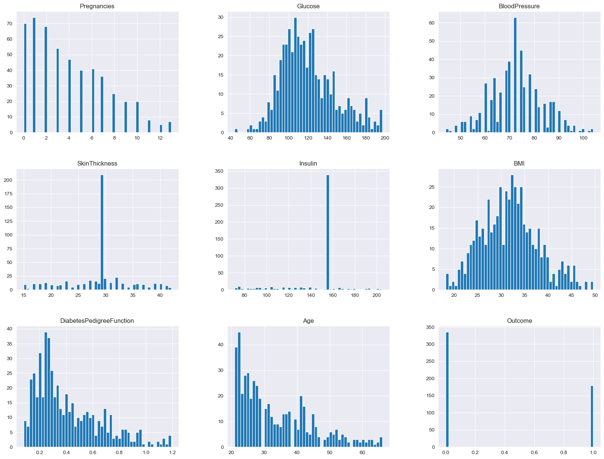

# Laporan Proyek Machine Learning - Jordan Marcelino

## Domain Proyek

Diabetes adalah salah satu penyakit kronis yang mempengaruhi jutaan orang di seluruh dunia. Tingginya penderita diabetes telah menjadi subjek penelitian yang luas untuk memahami faktor-faktor risiko yang terlibat dalam pengembangan penyakit ini. Klasifikasi dataset Pima Indians Diabetes menjadi penting dalam upaya untuk memahami ciri-khas penyakit ini dan mengambil langkah-langkah pencegahan yang tepat. Tujuan utama dari pemecahan masalah ini adalah untuk mengembangkan model klasifikasi yang efektif untuk memprediksi risiko diabetes [[1]](#1). Melalui analisis data yang tepat, model klasifikasi ini akan membantu dalam: identifikasi faktor-faktor risiko diabetes dan mendukung upaya pencegahan dengan mengidentifikasi individu yang berisiko tinggi. Metode pendekatan yang akan digunakan melibatkan teknik machine learning [[1]](#1), di mana dataset Pima Indians Diabetes akan diolah dan dianalisis menggunakan algoritma klasifikasi yang sesuai. Beberapa algoritma yang akan dieksplorasi termasuk Support Vector Machines (SVM), K-Nearest Neighbors (KNN), dan Random Forests. Pemilihan algoritma akan didasarkan pada hasil cross-validation, dan selanjutnya dilakukan hyperparameter tuning pada algoritma terbaik. Manfaat utama dari proyek ini untuk memberikan wawasan yang lebih baik tentang faktor-faktor risiko yang terkait dengan diabetes dan membantu mengidentifikasi faktor-faktor diabetes.

## Business Understanding

Untuk dapat mengidentifikasi faktor-faktor risiko yang terkait dengan diabetes, proyek ini melakukan analisis terhadap dataset Pima Indians Diabetes dengan pendekatan machine learning menggunakan algoritma klasifikasi.

### Problem Statements

-   Bagaimana efektivitas pendekatan _machine learning_ dalam mengklasifikan diabetes jika dilihat dari nilai metriks: akurasi, presisi, recall, dan f1-score?

### Goals

-   Mengevaluasi efektivitas pendekatan _machine learning_ dalam mengklasifikan diabetes dengan melihat nilai metriks: akurasi, presisi, recall, dan f1-score

    ### Solution statements

    -   Membandingkan 3 algoritma klasifikasi yaitu: SVM, KNN, dan Random Forest. Selanjutnya akan diambil model terbaik berdasarkan rata-rata nilai metrik f1 score dari hasil cross-validation dengan split sebanyak 5. Model terbaik akan diimprove dengan hyperparameter tuning menggunakan grid search dan cross validation dengan split sebanyak 5.

## Data Understanding

Data yang digunakan dalam proyek ini diambil dari [Kaggle Datasets](https://www.kaggle.com/datasets/nancyalaswad90/review) yang berjudul "**Diabetes Dataset - Pima Indians**". Terdapat 1 dataset yang disediakan yaitu:

1.  diabetes.csv

### Variabel-variabel pada Reddit_Combi dataset adalah sebagai berikut:

-   Pregnancies: Jumlah kehamilan
-   Glucose: Kadar glukosa dalam darah
-   BloodPressure: Pengukuran tekanan darah
-   SkinThickness: Ketebalan kulit
-   Insulin: Kadar insulin dalam darah
-   BMI: Indeks massa tubuh
-   DiabetesPedigreeFunction: Persentase diabetes
-   Age: Umur
-   Outcome: Hasil akhir dimana 1 adalah diabetes 0 tidak diabetes

### EDA (Exploratory Data Analysis)

-   Deskriptif data
    <table>
        <thead>
            <tr>
                <th>
                    #
                </th>
                <th>
                    Column
                </th>
                <th>
                    Non-Null Count
                </th>
                <th>
                    Dtype
                </th>
            </tr>
        </thead>
        <tbody>
            <tr>
                <td>1</td>
                <td>Pregnancies</td>
                <td>768 non-null</td>
                <td>int64</td>
            </tr>
            <tr>
                <td>2</td>
                <td>Glucose</td>
                <td>768 non-null</td>
                <td>int64</td>
            </tr>
            <tr>
                <td>3</td>
                <td>BloodPressure</td>
                <td>768 non-null</td>
                <td>int64</td>
            </tr>
            <tr>
                <td>4</td>
                <td>SkinThickness</td>
                <td>768 non-null</td>
                <td>int64</td>
            </tr>
            <tr>
                <td>5</td>
                <td>Insulin</td>
                <td>768 non-null</td>
                <td>int64</td>
            </tr>
            <tr>
                <td>6</td>
                <td>BMI</td>
                <td>768 non-null</td>
                <td>float64</td>
            </tr>
            <tr>
                <td>7</td>
                <td>DIabetesPedigreeFunction</td>
                <td>768 non-null</td>
                <td>float64</td>
            </tr>
            <tr>
                <td>8</td>
                <td>Age</td>
                <td>768 non-null</td>
                <td>int64</td>
            </tr>
            <tr>
                <td>9</td>
                <td>Outcome</td>
                <td>768 non-null</td>
                <td>int64</td>
            </tr>
        </tbody>
    </table>

    Tabel 1. Deskriptif Data

    Data yang digunakan berjumlah 768 baris dan terdiri dari 9 kolom. Label terdapat pada kolom "Outcome". Tidak ada fitur kategorikal, semua fitur adalah fitur numerikal.

-   Menvisualisasikan distribusi label
    
    Gambar 1. Distribusi Label

    Dapat dilihat pada Gambar 1 bahwa dataset ini termasuk imbalanced dataset, dimana terdapat ketidakseimbangan antar label. Label 0 berjumlah 500, sedangkan label 1 berjumlah 268.

-   Missing values

    <table>
        <thead>
            <tr>
                <th>
                    Column
                </th>
                <th>
                    Jumlah missing values
                </th>
            </tr>
        </thead>
        <tbody>
            <tr>
                <td>
                    Pregnancies
                </td>
                <td>
                    0
                </td>
            </tr>
            <tr>
                <td>
                    Glucose
                </td>
                <td>
                    5
                </td>
            </tr>
            <tr>
                <td>
                    BloodPressure
                </td>
                <td>
                    35
                </td>
            </tr>
            <tr>
                <td>
                    SkinThickness
                </td>
                <td>
                    227
                </td>
            </tr>
            <tr>
                <td>
                    Insulin
                </td>
                <td>
                    374
                </td>
            </tr>
            <tr>
                <td>
                    BMI
                </td>
                <td>
                    11
                </td>
            </tr>
            <tr>
                <td>
                    DiabetesPedigreeFunction
                </td>
                <td>
                    0
                </td>
            </tr>
            <tr>
                <td>
                    Age
                </td>
                <td>
                    0
                </td>
            </tr>
            <tr>
                <td>
                    Outcome
                </td>
                <td>
                    0
                </td>
            </tr>
        </tbody>
    </table>

    Tabel 2. Missing Values

    Terdapat missing values pada dataset seperti pada Tabel 2. Missing values akan diisi dengan nilai mean.

-   Univariate Analysis
    
    Gambar 2. Univariate Analysis

    Dapat dilihat pada Gambar 2, beberapa fitur memiliki distribusi yang normal, namun beberapa fitur juga condong ke arah kiri, dan terdapat pula fitur yang distribusinya terpusat di satu titik.

-   Multiavariate Analysis
    
    Gambar 3. Multivariate Analysis

    Tidak terlalu terlihat hubungan yang signifikan antara label dan masing-masing fitur berdasarkan Gambar 3.

    
    Gambar 4. Heatmap Multivariate

    Pada heatmap juga menunjukkan hubungan yang kurang kuat antara fitur dan label. Glucose menjadi fitur dengan nilai korelasi tertinggi.

## Data Preparation

### Data preprocessing

1.  Penanganan missing values
    Terdapat missing values pada dataset, dimana nilai 0 merupakan indikatornya. Nilai tersebut akan diisi dengan menggunakan imputasi nilai mean.

2.  Membuang outlier
    Nilai outlier akan dibuang menggunakan metode IQR. Nilai yang termasuk pada ambang outlier berdasarkan metode IQR akan dibuang, sehingga menghasilkan data dengan distribusi yang normal.

3.  Penanganan imbalanced label
    Karena terdapat ketidakseimbangan label pada data, maka akan digunakan teknik _over sampling_ dengan metode SMOTE. Kegunaannya adalah agar model dapat mempelajari dengan baik perbedaan antar label.

4.  Splitting data
    Data akan displit menjadi data latih dan data uji dengan data uji sebesar 20%. Data latih akan digunakan untuk melatih model, sedangkan data uji akan digunakan untuk mengukur performa model pada data yang belum pernah dilihat sebelumnya.

5.  Scaling data
    Selanjutnya data akan distandarisasi menggunakan Standard Scaler, dimana scaler akan dilatih pada data latih saja, lalu diterapkan ke data uji, sehingga menghindari adanya data leakage.

### Modeling

-   Tahapan pertama adalah data preprocessing, di mana data dari dataset dipersiapkan untuk digunakan dalam pembuatan model. Untuk lebih detail sudah dijelaskan pada bagian [data preparation](#data-preparation)

-   3 Algoritma klasifikasi, yaitu; KNN, SVM, dan Random Forests, akan dibandingkan menggunakan cross-validation dengan split = 5. Metrik evaluasi yang digunakan adalah f1 score, model dengan rata-rata nilai f1 score terbesar akan menjadi baseline model yang selanjutnya akan dilakukan hyperparameter tuning.

-   Random Forests menjadi algoritma terbaik pada proses perbandingan. Algoritma tersebut memiliki performa terbaik karena Random Forests secara implisit telah menerapkan proses seleksi fitur. Karena hubungan yang kurang signifikan antara fitur dan label, membuat algoritma lain kurang bisa mempelajari pola pada data, sedangkan algoritma Random Forests akan melakukan seleksi terhadap fitur yang kurang informatif. Maka dari itu Random Forests akan digunakan sebagai baseline model.

-   Proses hyperparameter tuning dilakukan untuk mencari kombinasi hyperparameter yang memberikan kinerja terbaik untuk model. Selanjutnya akan diterapkan teknik cross-validation dengan jumlah split sebanyak 5 untuk memeriksa kinerja model dengan berbagai kombinasi hyperparameter. Metrik utama yang digunakan dalam tuning dan cross-validation adalah f1 score, model dengan f1 score tertinggi akan dianggap sebagai model terbaik. Hyperparameter yang dituning sebagai berikut:

    -   n_estimators: [100, 200, 400]
    -   max_depth: [16, 32]
    -   min_samples_split: [2, 5]
    -   ccp_alpha: [0.001, 0.005, 0.007]

    Hasil hyperparameter tuning pada Random Forests menghasilkan model terbaik dengan hyperparameter sebagai berikut:

    -   n_estimators: 400
    -   max_depth: 16
    -   min_samples_split: 2
    -   ccp_alpha: 0.001

### Evaluation

Model akan dievaluasi pada test set untuk memastikan bahwa model tidak overfit, dan dapat memprediksi data yang belum pernah dilihat secara akurat. Terdapat 4 metrik evaluasi yang digunakan:

-   $ Accuracy = \frac{(TP+TN)}{(TP+TN+FN+FP)} $

-   $ Precision = \frac{TP}{(TP+FP)} $

-   $ Recall = \frac{TP}{(TP+FN)} $

-   $ F1 = \frac{(2*precision*recall)}{(precision+recall)} $

Keterangan:

-   TP (True Positive) = Prediksi 1, Ground Truth 1
-   TN (True Negative) = Prediksi 0, Ground Truth 0
-   FP (False Positive) = Prediksi 1, Ground Truth 0
-   FN (False Negative) = Prediksi 0, Ground Truth 1

Model terbaik menghasilkan hasil sebagai berikut:

-   Accuracy: 86%
-   Recall: 91%
-   Precision: 82%
-   F1: 86%

Metrik evaluasi diatas (akurasi, recall, precision, dan F1-score) memberikan gambaran yang komprehensif tentang kinerja model klasifikasi pada data uji.

1.  Accuracy:

    Akurasi mengukur seberapa sering model memberikan prediksi yang benar secara keseluruhan. Dalam konteks ini, akurasi model adalah 86%, yang berarti 86% dari semua kelas telah diklasifikasikan dengan benar. Akurasi yang tinggi menunjukkan bahwa model cenderung memberikan prediksi yang tepat secara keseluruhan.

2.  Recall:

    Recall mengukur seberapa baik model dapat mengidentifikasi semua contoh yang relevan dalam dataset.
    Recall 91% menunjukkan bahwa model mampu mengidentifikasi 91% dari semua kasus diabetes yang sebenarnya di dataset. Sebagai contoh, dengan recall yang tinggi, model dapat dengan baik mengidentifikasi sebagian besar kasus diabetes, mengurangi kemungkinan kasus yang terlewat.

3.  Precision:

    Precision mengukur seberapa sering prediksi positif model benar. Precision 82% berarti 82% dari semua prediksi positif yang dilakukan oleh model adalah benar. Precision yang tinggi menunjukkan bahwa ketika model menyatakan bahwa seseorang memiliki diabetes, itu cenderung benar dalam banyak kasus.

4.  F1-score:

    F1-score adalah ukuran rata-rata dari recall dan precision. Ini memberikan keseimbangan antara kedua metrik tersebut. F1-score 86% menunjukkan keseimbangan yang baik antara recall dan precision. F1-score yang tinggi menunjukkan bahwa model memiliki kinerja yang baik baik dalam mengidentifikasi kasus positif maupun dalam meminimalkan false positives.

Secara keseluruhan, kombinasi nilai yang tinggi untuk akurasi, recall, precision, dan F1-score menunjukkan bahwa model ini secara efektif dapat mengklasifikasikan kasus diabetes pada data uji dengan baik. Kinerja model yang tinggi dalam keempat metrik ini mengindikasikan bahwa pendekatan machine learning yang diadopsi telah berhasil dalam menyelesaikan permasalahan klasifikasi yang diangkat, sesuai dengan tujuan proyek.

### Referensi

 
[1] <a href='https://www.sciencedirect.com/science/article/pii/S2001037016300733'>Kavakiotis, I., Tsave, O., Salifoglou, A., Maglaveras, N., Vlahavas, I., & Chouvarda, I. (2017). Machine learning and data mining methods in diabetes research. Computational and structural biotechnology journal, 15, 104-116.</a>

