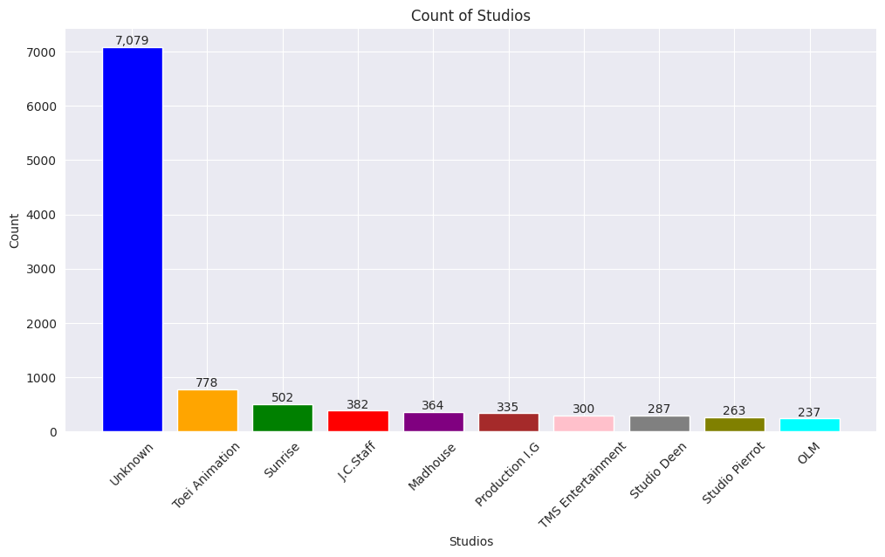

# Laporan Proyek Machine Learning - Jordan Marcelino

## Project Overview

Pertumbuhan yang pesat dalam industri anime dan jumlah judul yang terus bertambah setiap tahun atau bahkan bulan, pengguna sering kali merasa kewalahan dalam memilih judul yang sesuai dengan preferensi mereka. Oleh karena itu, sistem rekomendasi dapat membantu pengguna dalam menemukan anime baru yang sesuai dengan minat dan preferensi mereka.

Content-based filtering menggunakan karakteristik dari anime, seperti genre, studio produksi, dll, untuk merekomendasikan anime yang memiliki kesamaan dengan anime yang disukai pengguna. Pendekatan ini penting karena memungkinkan pengguna untuk menemukan anime baru yang memiliki karakteristik serupa dengan anime yang mereka nikmati sebelumnya [[1]](#1).

Di sisi lain, collaborative filtering memanfaatkan data rating dari pengguna lain untuk memberikan rekomendasi kepada pengguna. Pendekatan ini memperhitungkan preferensi pengguna lain yang memiliki pola rating serupa dengan pengguna yang sedang mencari rekomendasi. Hal ini penting karena dapat membantu pengguna menemukan anime yang mungkin tidak mereka temui dengan cara lain, berdasarkan kesamaan preferensi dengan pengguna lain [[1]](#1).

## Business Understanding

Untuk dapat memberikan rekomendasi anime yang sesuai dengan preferensi pengguna, proyek ini membuat sebuah sistem rekomendasi menggunakan pendekatan machine learning dengan dua metode, yaitu; content-based filtering dan collaborative filtering.

### Problem Statements

-   Bagaimana efektivitas sistem rekomendasi menggunakan metode content-based filtering jika dilihat dari kemiripan anime yang direkomendasikan berdasarkan gabungan dari beberapa fitur
-   Bagaimana efektivitas sistem rekomendasi menggunakan metode collaborative filtering jika dilihat dari nilai metriks: MSE (mean squared error)

### Goals

-   Mengevaluasi efektivitas sistem rekomendasi menggunakan metode content-based filtering dengan melihat kemiripan anime yang direkomendasikan berdasarkan gabungan dari beberapa fitur
-   Mengevaluasi efektivitas sistem rekomendasi menggunakan metode collaborative filtering dengan melihat nilai metriks: MSE (mean squared error)

    ### Solution statements

    -   Menggabungkan beberapa fitur anime menjadi satu fitur, lalu melakukan feature extraction menggunakan TF-IDF, dan membandingkan kemiripan antar anime menggunakan distance metric cosine similarity.
    -   Menggunakan kategori model based dengan pendekatan deep learning sebagai model utama, dan mengevaluasi performa model menggunakan nilai metriks: MSE.

## Data Understanding

Data yang digunakan dalam proyek ini diambil dari [Kaggle Datasets](https://www.kaggle.com/datasets/hernan4444/anime-recommendation-database-2020/data) yang berjudul "**Anime Recommendation Database 2020**". Dari 5 dataset yang tersedia, terdapat 2 dataset yang digunakan yaitu:

### 1. anime.csv

### Variabel-variabel pada anime dataset adalah sebagai berikut:

-   MAL_ID: MyAnimelist ID dari anime. (contoh: 1)
-   Name: Judul lengkap anime. (contoh: Cowboy Bebop)
-   Score: Rata-rata skor yang diberikan oleh semua user. (contoh: 8.78)
-   Genres: List genre anime yang dipisahkan dengan koma. (contoh: Action, Adventure, Comedy, Drama, Sci-Fi, Space)
-   English name: Judul lengkap anime dalam bahasa Inggris. (contoh: Cowboy Bebop)
-   Japanese name: Judul lengkap anime dalam bahasa Jepang. (contoh: カウボーイビバップ)
-   Type: TV, movie, OVA, dll. (contoh: TV)
-   Episodes: Banyak chapter. (contoh: 26)
-   Aired: Tanggal peluncuran. (contoh: Apr 3, 1998 to Apr 24, 1999)
-   Premiered: Musim premier. (contoh: Spring 1998)
-   Producers: List produser (contoh: Bandai Visual)
-   Licensors: List lisensi (contoh: Funimation, Bandai Entertainment)
-   Studios: List studio (contoh: Sunrise)
-   Source: Manga, Light novel, Book, dll. (e.g Original)
-   Duration: Durasi anime per episode (e.g 24 min. per ep.)
-   Rating: Batas umur (contoh: R - 17+ (violence & profanity))
-   Ranked: Posisi berdasarkan skor. (e.g 28)
-   Popularity: Posisi berdasarkan banyaknya user yang menambahkan anime ke list. (e.g 39)
-   Members: Banyaknya member komunitas di grup. (contoh: 1251960)
-   Favorites: Banyak user yang menambahkan ke favorite. (contoh: 61,971)
-   Watching: Banyak user yang sudah menonton. (contoh: 105808)
-   Completed: Banyak user yang sudah menonton sampai habis. (contoh: 718161)
-   On-Hold: Banyaknya user yang menunda untuk menonton. (contoh: 71513)
-   Dropped: Banyaknya user yang membuang anime dari list. (contoh: 26678)
-   Plan to Watch': Banyaknya user yang menambahkan anime ke list untuk ditonton. (contoh: 329800)
-   Score-10': Banyaknya user yang memberikan skor 10. (contoh: 229170)
-   Score-9': Banyaknya user yang memberikan skor 9. (contoh: 182126)
-   Score-8': Banyaknya user yang memberikan skor 8. (contoh: 131625)
-   Score-7': Banyaknya user yang memberikan skor 7. (contoh: 62330)
-   Score-6': Banyaknya user yang memberikan skor 6. (contoh: 20688)
-   Score-5': Banyaknya user yang memberikan skor 5. (contoh: 8904)
-   Score-4': Banyaknya user yang memberikan skor 4. (contoh: 3184)
-   Score-3': Banyaknya user yang memberikan skor 3. (contoh: 1357)
-   Score-2': Banyaknya user yang memberikan skor 2. (contoh: 741)
-   Score-1': Banyaknya user yang memberikan skor 1. (contoh: 1580)

### 2. animelist.csv

### Variabel-variabel pada animelist dataset adalah sebagai berikut:

-   user_id: Id user.
-   anime_id: MyAnimeList ID dari anime.
-   score: Skor yang diberikan user dari 1-10. 0 jika user tidak memberikan skor.
-   watching_status: ID status anime yang diberikan user.
-   watched_episodes: Banyaknya episode yang ditonton user.

### EDA (Exploratory Data Analysis)

-   Deskriptif data
    <table>
        <thead>
            <tr>
                <th>
                    #
                </th>
                <th>
                    Column
                </th>
                <th>
                    Non-Null Count
                </th>
                <th>
                    Dtype
                </th>
            </tr>
        </thead>
        <tbody>
            <tr>
                <td>1</td>
                <td>MAL_ID</td>
                <td>17562 non-null</td>
                <td>int64</td>
            </tr>
            <tr>
                <td>2</td>
                <td>Name</td>
                <td>17562 non-null</td>
                <td>object</td>
            </tr>
            <tr>
                <td>3</td>
                <td>Score</td>
                <td>17562 non-null</td>
                <td>object</td>
            </tr>
            <tr>
                <td>4</td>
                <td>Genres</td>
                <td>17562 non-null</td>
                <td>object</td>
            </tr>
            <tr>
                <td>5</td>
                <td>English name</td>
                <td>17562 non-null</td>
                <td>object</td>
            </tr>
            <tr>
                <td>6</td>
                <td>Japanese name</td>
                <td>17562 non-null</td>
                <td>float64</td>
            </tr>
            <tr>
                <td>7</td>
                <td>Type</td>
                <td>17562 non-null</td>
                <td>float64</td>
            </tr>
            <tr>
                <td>8</td>
                <td>Episodes</td>
                <td>17562 non-null</td>
                <td>object</td>
            </tr>
            <tr>
                <td>9</td>
                <td>Aired</td>
                <td>17562 non-null</td>
                <td>object</td>
            </tr>
            <tr>
                <td>10</td>
                <td>Premiered</td>
                <td>17562 non-null</td>
                <td>object</td>
            </tr>
            <tr>
                <td>11</td>
                <td>Producers</td>
                <td>17562 non-null</td>
                <td>object</td>
            </tr>
            <tr>
                <td>12</td>
                <td>Licensors</td>
                <td>17562 non-null</td>
                <td>object</td>
            </tr>
            <tr>
                <td>13</td>
                <td>Studios</td>
                <td>17562 non-null</td>
                <td>object</td>
            </tr>
            <tr>
                <td>14</td>
                <td>Source</td>
                <td>17562 non-null</td>
                <td>object</td>
            </tr>
            <tr>
                <td>15</td>
                <td>Duration</td>
                <td>17562 non-null</td>
                <td>object</td>
            </tr>
            <tr>
                <td>16</td>
                <td>Rating</td>
                <td>17562 non-null</td>
                <td>object</td>
            </tr>
            <tr>
                <td>17</td>
                <td>Ranked</td>
                <td>17562 non-null</td>
                <td>int64</td>
            </tr>
            <tr>
                <td>18</td>
                <td>Popularity</td>
                <td>17562 non-null</td>
                <td>int64</td>
            </tr>
            <tr>
                <td>19</td>
                <td>Members</td>
                <td>17562 non-null</td>
                <td>int64</td>
            </tr>
            <tr>
                <td>20</td>
                <td>Favorites</td>
                <td>17562 non-null</td>
                <td>int64</td>
            </tr>
            <tr>
                <td>21</td>
                <td>Watching</td>
                <td>17562 non-null</td>
                <td>int64</td>
            </tr>
            <tr>
                <td>22</td>
                <td>Completed</td>
                <td>17562 non-null</td>
                <td>int64</td>
            </tr>
            <tr>
                <td>23</td>
                <td>On-Hold</td>
                <td>17562 non-null</td>
                <td>int64</td>
            </tr>
            <tr>
                <td>24</td>
                <td>Dropped</td>
                <td>17562 non-null</td>
                <td>int64</td>
            </tr>
            <tr>
                <td>25</td>
                <td>Plan to Watch</td>
                <td>17562 non-null</td>
                <td>object</td>
            </tr>
            <tr>
                <td>26</td>
                <td>Score-10</td>
                <td>17562 non-null</td>
                <td>object</td>
            </tr>
            <tr>
                <td>27</td>
                <td>Score-9</td>
                <td>17562 non-null</td>
                <td>object</td>
            </tr>
            <tr>
                <td>28</td>
                <td>Score-8</td>
                <td>17562 non-null</td>
                <td>object</td>
            </tr>
            <tr>
                <td>29</td>
                <td>Score-7</td>
                <td>17562 non-null</td>
                <td>object</td>
            </tr>
            <tr>
                <td>30</td>
                <td>Score-6</td>
                <td>17562 non-null</td>
                <td>object</td>
            </tr>
            <tr>
                <td>31</td>
                <td>Score-5</td>
                <td>17562 non-null</td>
                <td>object</td>
            </tr>
            <tr>
                <td>32</td>
                <td>Score-4</td>
                <td>17562 non-null</td>
                <td>object</td>
            </tr>
            <tr>
                <td>33</td>
                <td>Score-3</td>
                <td>17562 non-null</td>
                <td>object</td>
            </tr>
            <tr>
                <td>34</td>
                <td>Score-2</td>
                <td>17562 non-null</td>
                <td>object</td>
            </tr>
            <tr>
                <td>35</td>
                <td>Score-1</td>
                <td>17562 non-null</td>
                <td>object</td>
            </tr>
        </tbody>
    </table>

    Tabel 1. Deskriptif Data anime.csv

    <table>
        <thead>
            <tr>
                <th>
                    #
                </th>
                <th>
                    Column
                </th>
                <th>
                    Non-Null Count
                </th>
                <th>
                    Dtype
                </th>
            </tr>
        </thead>
        <tbody>
            <tr>
                <td>1</td>
                <td>user_id</td>
                <td>109224747 non-null</td>
                <td>int64</td>
            </tr>
            <tr>
                <td>2</td>
                <td>anime_id</td>
                <td>109224747 non-null</td>
                <td>int64</td>
            </tr>
            <tr>
                <td>3</td>
                <td>rating</td>
                <td>109224747 non-null</td>
                <td>int64</td>
            </tr>
            <tr>
                <td>4</td>
                <td>watching_status</td>
                <td>109224747 non-null</td>
                <td>int64</td>
            </tr>
            <tr>
                <td>5</td>
                <td>watching_episode</td>
                <td>109224747 non-null</td>
                <td>int64</td>
            </tr>
        </tbody>
    </table>

    Tabel 2. Deskriptif Data animelist.csv

    Terdapat dua dataset yang digunakan yaitu; anime.csv dan animelist.csv. Untuk dataset anime.csv terdiri dari 35 kolom dan 17562 baris, yang berarti terdapat 17 ribu anime yang terdaftar. Untuk dataset animelist.csv terdiri dari 5 kolom dan 109224747 baris, jumlah data yang sangat besar sekali yang berarti jumlah penggemar anime sangatlah besar.

-   Univariate Analysis
    <table>
        <thead>
            <tr>
                <th> Kolom </th>
                <th> Jumlah anime </th>
                <th> Value </th>
            </tr>
        </thead>
        <tbody>
            <tr>
                <td> Genres </td>
                <td> 44 </td>
                <td> ['Action' 'Adventure' 'Comedy' 'Drama' 'Sci-Fi' 'Space' 'Mystery 'Shounen' 'Police' 'Supernatural'] </td>
            </tr>
            <tr>
                <td> Type </td>
                <td> 7 </td>
                <td> ['TV' 'Movie' 'OVA' 'Special' 'ONA' 'Music' 'Unknown'] </td>
            </tr>
            <tr>
                <td> Studio </td>
                <td> 723 </td>
                <td> ['Sunrise' 'Bones' 'Madhouse' 'Toei Animation' 'Gallop' 'J.C.Staff' 'Nippon Animation' 'A.C.G.T.' 'Studio Pierrot' 'Trans Arts'] </td>
            </tr>
            <tr>
                <td> Source </td>
                <td> 16 </td>
                <td> ['Original' 'Manga' 'Light novel' 'Game' 'Visual novel' '4-koma manga'
                'Novel' 'Unknown' 'Other' 'Picture book' 'Web manga' 'Music' 'Radio' 'Book' 'Card game' 'Digital manga'] </td>
            </tr>
        </tbody>
    </table>

    Tabel 3. Univariate Analysis anime.csv

    Terdapat 44 genre berbeda dalam anime, 7 tipe penayangan, 723 studio, dan 16 sumber adaptasi anime pada dataset anime.csv.

    
    Gambar 1. Distribusi genre anime

    Dari 44 genre yang tersedia, genre comedy mendominasi dengan jumlah sekitar 6000 anime yang bergenre comedy, lalui diikuti dengan genre action, fantasy, dan adventure.

    
    Gambar 2. Distribusi type anime

    TV, OVA, dan Movie menjadi tipe penayangan terbanyak anime. Terdapat juga 37 anime yang tidak diketahui jenis penanyangannya.

    
    Gambar 3. Distribusi sumber adaptasi anime

    Sebagian besar anime merupakan anime original yang berarti tidak dibuat berdasarkan sumber tertentu. Lalu diikuti dengan adaptasi manga, dan sumber yang tidak diketahui.

    
    Gambar 4. Distribusi studio anime

    Terdapat 7079 anime yang tidak diketahui studio yang menggarap anime tersebut, namun perlu diketahui bahwa satu anime bisa digarap oleh beberapa studio sekaligus. Distribusi studio anime dapat dikatan rata dan tidak ada yang terlalu mendominasi.

    <table>
        <thead>
            <tr>
                <th> Jumlah pengguna </th>
                <th> Jumlah anime </th>
                <th> Jumlah rating </th>
            </tr>
        </thead>
        <tbody>
            <tr>
                <td> 325770 </td>
                <td> 17562 </td>
                <td> 109224747 </td>
            </tr>
        </tbody>
    </table>

    Tabel 4. Univariate Analysis animelist.csv

    Dari 109224747 yang diberikan, terdapat 325770 user yang berpartisipasi, dengan jumlah anime sama dengan dataset anime.csv yaitu 17562.

    

    Gambar 5. Distribusi rating anime

    Sebagian besar anime memiliki rating 0 yang berarti user belum memberikan rating terhadap anime tersebut. Untuk rating yang diberikan oleh user sendiri paling banyak antara rating 7-9.

## Data Preparation

### Data preprocessing

1.  Memfilter kolom
    Dari banyaknya fitur yang tersedia pada dataset anime.csv, akan diambil beberapa saja yang dapat mendeskripsikan anime, yaitu; MAL_ID, Name, Genres, Type, Studios, dan Source. Sedangkan untuk dataset animelist.csv akan diambil user_id, anime_id, dan rating.

2.  Membuang unknown values
    Pada fitur anime, terdapat nilai "unknown" yang berarti tidak diketahui. Nilai tersebut akan mengurangi performa model karena menghadirkan ambiguitas, sehingga value tersebut akan dibuang.

3.  Menggabungkan beberapa fitur menjadi satu
    Beberapa fitur pada dataset anime.csv akan digabungkan menjadi satu fitur yang terdiri dari fitur; Genres, Type, Sources. Fitur tersebut nantinya akan digunakan untuk membandingkan kemiripan antar anime.

### Modeling

1.  Content-Based Filtering

    -   Tahapan pertama adalah data preprocessing, di mana data dari dataset dipersiapkan untuk digunakan dalam pembuatan model. Untuk lebih detail sudah dijelaskan pada bagian [data preparation](#data-preparation)

    -   Fitur yang merupakan gabungan dari beberapa fitur akan dilakukan feature extraction menggunakan TF-IDF dan diubah menjadi sebuah matrix yang merepresentasikan fitur yang sudah diekstrak dari masing-masing anime.

    -   Matrix yang dihasilkan akan digunakan untuk mengukur kemiripan antar anime dengan menggunakan distance metric cosine similarity. Sebuah matrix kembali dihasilkan yang nilainya antara 0-1, dimana semakin mendekati 1 maka anime tersebut semakin mirip, semakin mendekati 0 maka anime tersebut semakin berbeda.

    -   Hasil dari cosine similarity digunakan untuk mencari anime yang mirip dengan anime yang sedang dicari atau ditonton oleh user, dimana akan ditampilkan top 10 anime yang mirip berdasarkan hasil cosine similarity. Berikut contoh hasil rekomendasi:

    | Name                                    | Genres                                            | Studios        | Type  | Source |
    | --------------------------------------- | ------------------------------------------------- | -------------- | ----- | ------ |
    | Dragon Ball Kai                         | Action, Adventure, Comedy, Fantasy, Martial Ar... | Toei Animation | TV    | Manga  |
    | Dragon Ball Super                       | Action, Adventure, Comedy, Super Power, Martia... | Toei Animation | TV    | Manga  |
    | Dragon Ball Kai (2014)                  | Action, Adventure, Comedy, Super Power, Martia... | Toei Animation | TV    | Manga  |
    | Dragon Ball                             | Adventure, Comedy, Fantasy, Martial Arts, Shou... | Toei Animation | TV    | Manga  |
    | Naruto                                  | Action, Adventure, Comedy, Super Power, Martia... | Studio Pierrot | TV    | Manga  |
    | Naruto: Shippuuden                      | Action, Adventure, Comedy, Super Power, Martia... | Studio Pierrot | TV    | Manga  |
    | Dragon Ball Z: Atsumare! Gokuu World    | Action, Adventure, Comedy, Super Power, Martia... | Toei Animation | OVA   | Manga  |
    | Boruto: Naruto Next Generations         | Action, Adventure, Super Power, Martial Arts, ... | Studio Pierrot | TV    | Manga  |
    | Rekka no Honoo                          | Action, Adventure, Martial Arts, Shounen, Supe... | Studio Pierrot | TV    | Manga  |
    | Dragon Ball Z Movie 15: Fukkatsu no "F" | Action, Adventure, Comedy, Super Power, Martia... | Toei Animation | Movie | Manga  |

    Tabel 5. Rekomendasi anime yang mirip dengan Dragon Ball Z
      

    | Name                                          | Genres                                            | Studios                           | Type    | Source |
    | --------------------------------------------- | ------------------------------------------------- | --------------------------------- | ------- | ------ |
    | Fullmetal Alchemist                           | Action, Adventure, Comedy, Drama, Fantasy, Mag... | Bones                             | TV      | Manga  |
    | Fullmetal Alchemist: The Sacred Star of Milos | Action, Adventure, Comedy, Drama, Fantasy, Mag... | Bones                             | Movie   | Manga  |
    | Fullmetal Alchemist: Brotherhood Specials     | Military, Adventure, Drama, Magic, Fantasy, Sh... | Bones                             | Special | Manga  |
    | Katsute Kami Datta Kemono-tachi e             | Action, Drama, Fantasy, Military, Shounen         | MAPPA                             | TV      | Manga  |
    | Fairy Tail: Final Series                      | Action, Adventure, Comedy, Magic, Fantasy, Sho... | A-1 Pictures, Bridge, CloverWorks | TV      | Manga  |
    | Fairy Tail (2014)                             | Action, Adventure, Comedy, Fantasy, Magic, Sho... | A-1 Pictures, Bridge              | TV      | Manga  |
    | Fairy Tail                                    | Action, Adventure, Comedy, Magic, Fantasy, Sho... | Satelight, A-1 Pictures           | TV      | Manga  |
    | Magi: The Labyrinth of Magic                  | Action, Adventure, Fantasy, Magic, Shounen        | A-1 Pictures                      | TV      | Manga  |
    | Magi: Sinbad no Bouken (TV)                   | Action, Adventure, Fantasy, Magic, Shounen        | Lay-duce                          | TV      | Manga  |
    | Magi: The Kingdom of Magic                    | Action, Adventure, Magic, Fantasy, Shounen        | A-1 Pictures                      | TV      | Manga  |

    Tabel 6. Rekomendasi anime yang mirip dengan Fullmetal Alchemist: Brotherhood
      

2.  Collaborative Filtering

    -   Karena keterbatasan resource hardware, dataset animelist.csv akan disampel sebanyak 100.000 data saja, karena data aslinya yang terlalu besar, yaitu mencapai 100 juta sampel.

    -   Dilakukan encoding pada user_id dan anime_id, dan rating akan discaling menjadi 0-1 menggunakan metode MinMaxScaler.

    -   Data akan diacak terlebih dahulu, lalu dibagi menjadi data latih dan data uji dengan proporsi 95% data latih, 5% data uji.

    -   Model deep learning akan dilatih pada data latih dan divalidasi menggunakan data uji, dengan jumlah epochs sebanyak 20. Optimizer yang digunakan adalah Adam dengan learning rate 0.001, dan fungsi metriks yang digunakan MSE. Berikut contoh hasil rekomendasi:

    | MAL_ID | Name                                  | Genres                                            | Type    | Studios           | Source |
    | ------ | ------------------------------------- | ------------------------------------------------- | ------- | ----------------- | ------ |
    | 238    | Rekka no Honoo                        | Action, Adventure, Martial Arts, Shounen, Supe... | TV      | Studio Pierrot    | Manga  |
    | 255    | Jungle wa Itsumo Hare nochi Guu Final | Slice of Life, Comedy                             | OVA     | Shin-Ei Animation | Manga  |
    | 646    | Haunted Junction                      | Comedy, Supernatural, School, Shounen             | TV      | Studio Deen       | Manga  |
    | 1693   | Reideen                               | Action, Mecha, Sci-Fi                             | TV      | Production I.G    |        |
    | 2154   | Tekkon Kinkreet                       | Action, Adventure, Psychological, Supernatural    | Movie   | Studio 4°C        | Manga  |
    | 2791   | Makasete Iruka!                       | Action, Comedy, School                            | OVA     | Unknown           | Manga  |
    | 4554   | Dokkiri Doctor                        | Slice of Life, Comedy, School                     | TV      | Studio Pierrot    | Manga  |
    | 7174   | Usaru-san                             | Kids                                              | Special | OLM               |        |

    Tabel 7. Rekomendasi anime dengan colaborative filtering

### Evaluation

1.  Content-Based Filtering

    Evaluasi dilakukan dengan cara melihat kemiripan anime yang direkomendasikan dengan anime yang sedang dicari atau ditonton oleh user. Fitur yang digunakan adalah: Genres, Type, dan Source, maka kemiripan anime akan dilihat dari kemiripan ketiga fitur tersebut. Nilai metrik yang digunakan adalah:

    -   $P = \frac{m}{n}$

    Keterangan:

    -   $P$ = Recommender system precision
    -   $m$ = Banyak rekomendasi yang relevan
    -   $n$ = Banyak rekomendasi yang diberikan

    Dapat dilihat pada Tabel 5 dan 6, bahwa anime yang direkomendasi memiliki kemiripan di tiga fitur yaitu: Genres, Type, dan Source. Untuk banyak rekomendasi yang diberikan adalah 10. Berikut analisi perhitungan nilai metrik:

    1.  Dragon Ball Z

        Genre: Action, Adventure, Comedy, Fantasy

        Source: Manga

        Type: TV

        Melihat pada rekomendasi yang diberikan dan mengacu pada ketiga fitur tersebut, 8 dari 10 anime yang direkomendasikan memiliki kesamaan pada ketiga fitur tersebut. 2 anime lainnya yaitu; Dragon Ball Z: Atsumare! Gokuu World dan Dragon Ball Z Movie 15: Fukkatsu no "F", memiliki kesamaan pada fitur Genre dan Source, namun untuk fitur Type berbeda. Maka pada case ini nilai presisi adalah
        80%.

    2.  Fullmetal Alchemist: Brotherhood

        Genre: Action, Adventure, Drama, Fantasy

        Source: Manga

        Type: TV

        Melihat pada rekomendasi yang diberikan dan mengacu pada ketiga fitur tersebut, 8 dari 10 anime yang direkomendasikan memiliki kesamaan pada ketiga fitur tersebut. 2 anime lainnya yaitu; Fullmetal Alchemist: The Sacred Star of Milos dan Fullmetal Alchemist: Brotherhood Specials, memiliki kesamaan pada fitur Genre dan Source, namun untuk fitur Type berbeda. Maka pada case ini nilai presisi adalah 80%.

    Secara keseluruhan, rekomendasi anime yang diberikan memiliki tingkat presisi yang tinggi yaitu 80%. Tingkat presisi yang tinggi mengindikasikan bahwa pendekatan content-based filtering telah berhasil dalam menyelesaikan permasalahan yang diangkat.

2.  Collaborative Filtering

    Model akan dievaluasi pada data uji. Metrik evaluasi yang digunakan adalah:

    -   $ MSE = \frac{1}{n} \sum \_{i=1} ^{n}(Y_i - \hat{Y_i})^2$

    Keterangan:

    -   MSE = Mean Squared Error
    -   n = Banyak sampel
    -   $ Y_i $ = Rating asli
    -   $ \hat{Y_i} $ = Rating prediksi

    

    Gambar 6. Learning curve model

    Model memberikan hasil akhir MSE 0.1472 pada data latih dan 0.0210 pada data latih. Jika dilihat dari hasil tersebut dan Gambar 6, dapat disimpulkan bahwa model overfit. Namun, nilai tersebut masih cukup bagus untuk sistem rekomendasi.

    Secara keseluruhan, anime yang direkomendasikan masih berhubungan dengan anime yang diberi rating besar oleh user. Hal ini dapat dilihat dari kemiripan genre anime yang direkomendasikan dengan yang diberi rating besar oleh user. Kinerja model yang tinggi mengindikasikan bahwa pendekatan collaborative filtering telah berhasil dalam menyelesaikan permasalahan yang diangkat, sesuai dengan tujuan proyek.

### Referensi

 
[1] <a href='https://papers.ssrn.com/sol3/papers.cfm?abstract_id=4121831'>Jena, A., Jaiswal, A., Lal, D., Rao, S., Ayubi, A., & Sachdeva, N. (2022, May). Recommendation System For Anime Using Machine Learning Algorithms. In Proceedings of the International Conference on Innovative Computing & Communication (ICICC).</a>

